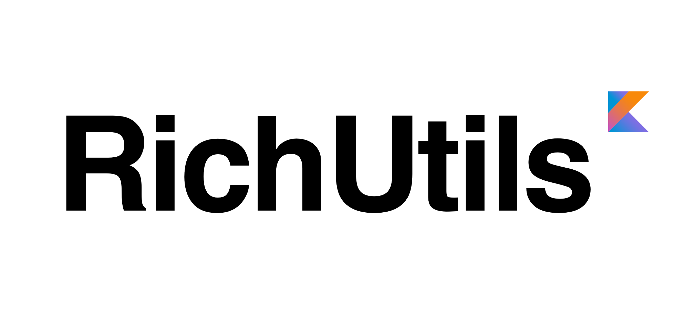

# RichUtils [](https://jitpack.io/#WindSekirun/RichUtilsKt) [](https://circleci.com/gh/WindSekirun/RichUtilsKt) [](https://codebeat.co/projects/github-com-windsekirun-richutilskt-master)

[](http://kotlinlang.org)	[](http://www.apache.org/licenses/LICENSE-2.0) [](https://android-arsenal.com/details/1/5854) [](https://github.com/KotlinBy/awesome-kotlin) [](https://github.com/KotlinBy/awesome-kotlin) [](https://android-arsenal.com/api?level=14)



### About
Version: 2.0.0 :: **Dreaming Bird** (夢魅鳥, Yumemidori) ::
* Release Note (Eng) : https://blog.uzuki.live/richutils-2-0-0-dreaming-bird-release-note-english-2017-11-23/
* Release Note (한글) : https://blog.uzuki.live/richutils-2-0-0-dreaming-bird-release-note-2017-11-23/

RichUtils is Advancement Utils for Android, written in [Kotlin](http://kotlinlang.org). Everything you need is Here! RichUtils work for you for solve necessary things, bother things in development process. I assure you that RichUtils will help you.

It provides...
* Countless high-quality Utils, Widget!
* KDoc(Kotlin Document) written in [Dokka](https://github.com/Kotlin/dokka), Documentation Engine for Kotlin. https://windsekirun.github.io/RichUtilsKt/-rich-utils/index.html
* **100% Java Interop Library**, it can use with Java within Kotlin-plugin integrated project

#### Important changes 2.0.0 -> 2.1.0
* minSdkVersion will increase 16 (Android 4.1) from 14 (Android 4.0)
* targetSdkVersion will increase 27 (Android 8.1) from 26 (Android 8.0)
* Having 'appcompat-v7:27.1.1' as Dependency

### Usages
*rootProject/build.gradle*
```	
allprojects {
    repositories {
	    maven { url 'https://jitpack.io' }
    }
}
```

*app/build.gradle*
```
dependencies {
    implementation 'com.github.WindSekirun:RichUtilsKt:2.1.0'
}
```

### Contents

## Full Method List in RichUtils.class
[Go to WIKI](https://github.com/WindSekirun/RichUtilsKt/wiki/Full-Method-List)

#### Utils

* [RAlert.kt](https://github.com/WindSekirun/RichUtilsKt/blob/master/RichUtils/src/main/java/pyxis/uzuki/live/richutilskt/utils/RAlert.kt)
* [RAssets.kt](https://github.com/WindSekirun/RichUtilsKt/blob/master/RichUtils/src/main/java/pyxis/uzuki/live/richutilskt/utils/RAssets.kt)
* [RAsync.kt](https://github.com/WindSekirun/RichUtilsKt/blob/master/RichUtils/src/main/java/pyxis/uzuki/live/richutilskt/utils/RAsync.kt)
* [RBitmap.kt](https://github.com/WindSekirun/RichUtilsKt/blob/master/RichUtils/src/main/java/pyxis/uzuki/live/richutilskt/utils/RBitmap.kt)
* [RBundle.kt](https://github.com/WindSekirun/RichUtilsKt/blob/master/RichUtils/src/main/java/pyxis/uzuki/live/richutilskt/utils/RBundle.kt)
* [RClipboard.kt](https://github.com/WindSekirun/RichUtilsKt/blob/master/RichUtils/src/main/java/pyxis/uzuki/live/richutilskt/utils/RClipboard.kt)
* [RContactProvider.kt](https://github.com/WindSekirun/RichUtilsKt/blob/master/RichUtils/src/main/java/pyxis/uzuki/live/richutilskt/utils/RContactProvider.kt)
* [RDate.kt](https://github.com/WindSekirun/RichUtilsKt/blob/master/RichUtils/src/main/java/pyxis/uzuki/live/richutilskt/utils/RDate.kt)
* [RDeviceId.kt](https://github.com/WindSekirun/RichUtilsKt/blob/master/RichUtils/src/main/java/pyxis/uzuki/live/richutilskt/utils/RDeviceId.kt)
* [RDimen.kt](https://github.com/WindSekirun/RichUtilsKt/blob/master/RichUtils/src/main/java/pyxis/uzuki/live/richutilskt/utils/RDimen.kt)
* [RDrawable.kt](https://github.com/WindSekirun/RichUtilsKt/blob/master/RichUtils/src/main/java/pyxis/uzuki/live/richutilskt/utils/RDrawable.kt)
* [RFile.kt](https://github.com/WindSekirun/RichUtilsKt/blob/master/RichUtils/src/main/java/pyxis/uzuki/live/richutilskt/utils/RFile.kt)
* [RFont.kt](https://github.com/WindSekirun/RichUtilsKt/blob/master/RichUtils/src/main/java/pyxis/uzuki/live/richutilskt/utils/RFont.kt)
* [RHintSpinner.kt](https://github.com/WindSekirun/RichUtilsKt/blob/master/RichUtils/src/main/java/pyxis/uzuki/live/richutilskt/utils/RHintSpinner.kt)
* [RInflater.kt](https://github.com/WindSekirun/RichUtilsKt/blob/master/RichUtils/src/main/java/pyxis/uzuki/live/richutilskt/utils/RInflater.kt)
* [RIntent.kt](https://github.com/WindSekirun/RichUtilsKt/blob/master/RichUtils/src/main/java/pyxis/uzuki/live/richutilskt/utils/RIntent.kt)
* [RInternal.kt](https://github.com/WindSekirun/RichUtilsKt/blob/master/RichUtils/src/main/java/pyxis/uzuki/live/richutilskt/utils/RInternal.kt)
* [RJson.kt](https://github.com/WindSekirun/RichUtilsKt/blob/master/RichUtils/src/main/java/pyxis/uzuki/live/richutilskt/utils/RJson.kt)
* [RKeyHash.kt](https://github.com/WindSekirun/RichUtilsKt/blob/master/RichUtils/src/main/java/pyxis/uzuki/live/richutilskt/utils/RKeyHash.kt)
* [RKeyboard.kt](https://github.com/WindSekirun/RichUtilsKt/blob/master/RichUtils/src/main/java/pyxis/uzuki/live/richutilskt/utils/RKeyboard.kt)
* [RNetwork.kt](https://github.com/WindSekirun/RichUtilsKt/blob/master/RichUtils/src/main/java/pyxis/uzuki/live/richutilskt/utils/RNetwork.kt)
* [RNotification.kt](https://github.com/WindSekirun/RichUtilsKt/blob/master/RichUtils/src/main/java/pyxis/uzuki/live/richutilskt/utils/RNotification.kt)
* [RPermission.kt](https://github.com/WindSekirun/RichUtilsKt/blob/master/RichUtils/src/main/java/pyxis/uzuki/live/richutilskt/utils/RPermission.kt)
* [RPhoto.kt](https://github.com/WindSekirun/RichUtilsKt/blob/master/RichUtils/src/main/java/pyxis/uzuki/live/richutilskt/utils/RPhoto.kt)
* [RPickMedia.kt](https://github.com/WindSekirun/RichUtilsKt/blob/master/RichUtils/src/main/java/pyxis/uzuki/live/richutilskt/utils/RPickMedia.kt)
* [RPreference.kt](https://github.com/WindSekirun/RichUtilsKt/blob/master/RichUtils/src/main/java/pyxis/uzuki/live/richutilskt/utils/RPreference.kt)
* [RProcess.kt](https://github.com/WindSekirun/RichUtilsKt/blob/master/RichUtils/src/main/java/pyxis/uzuki/live/richutilskt/utils/RProcess.kt)
* [RReboot.kt](https://github.com/WindSekirun/RichUtilsKt/blob/master/RichUtils/src/main/java/pyxis/uzuki/live/richutilskt/utils/RReboot.kt)
* [RSize.kt](https://github.com/WindSekirun/RichUtilsKt/blob/master/RichUtils/src/main/java/pyxis/uzuki/live/richutilskt/utils/RSize.kt)
* [RStatusBar.kt](https://github.com/WindSekirun/RichUtilsKt/blob/master/RichUtils/src/main/java/pyxis/uzuki/live/richutilskt/utils/RStatusBar.kt)
* [RStream.kt](https://github.com/WindSekirun/RichUtilsKt/blob/master/RichUtils/src/main/java/pyxis/uzuki/live/richutilskt/utils/RStream.kt)
* [RSystemFontEngine.kt](https://github.com/WindSekirun/RichUtilsKt/blob/master/RichUtils/src/main/java/pyxis/uzuki/live/richutilskt/utils/RSystemFontEngine.kt)
* [RSystemService.kt](https://github.com/WindSekirun/RichUtilsKt/blob/master/RichUtils/src/main/java/pyxis/uzuki/live/richutilskt/utils/RSystemService.kt)
* [RText.kt](https://github.com/WindSekirun/RichUtilsKt/blob/master/RichUtils/src/main/java/pyxis/uzuki/live/richutilskt/utils/RText.kt)
* [RThread.kt](https://github.com/WindSekirun/RichUtilsKt/blob/master/RichUtils/src/main/java/pyxis/uzuki/live/richutilskt/utils/RThread.kt)
* [RThumbnail.kt](https://github.com/WindSekirun/RichUtilsKt/blob/master/RichUtils/src/main/java/pyxis/uzuki/live/richutilskt/utils/RThumbnail.kt)
* [RUnReadCount.kt](https://github.com/WindSekirun/RichUtilsKt/blob/master/RichUtils/src/main/java/pyxis/uzuki/live/richutilskt/utils/RUnReadCount.kt)
* [RVersion.kt](https://github.com/WindSekirun/RichUtilsKt/blob/master/RichUtils/src/main/java/pyxis/uzuki/live/richutilskt/utils/RVersion.kt)
* [RVibrate.kt](https://github.com/WindSekirun/RichUtilsKt/blob/master/RichUtils/src/main/java/pyxis/uzuki/live/richutilskt/utils/RVibrate.kt)
* [RVideo.kt](https://github.com/WindSekirun/RichUtilsKt/blob/master/RichUtils/src/main/java/pyxis/uzuki/live/richutilskt/utils/RVideo.kt)
* [RView.kt](https://github.com/WindSekirun/RichUtilsKt/blob/master/RichUtils/src/main/java/pyxis/uzuki/live/richutilskt/utils/RView.kt)

### Widget
* [CenteredIconButton](https://github.com/WindSekirun/RichUtilsKt/blob/master/RichUtils/src/main/java/pyxis/uzuki/live/richutilskt/widget/CenteredIconButton.kt)
* [CombinedTextView](https://github.com/WindSekirun/RichUtilsKt/blob/master/RichUtils/src/main/java/pyxis/uzuki/live/richutilskt/widget/CombinedTextView.kt)
* [CombinedButton](https://github.com/WindSekirun/RichUtilsKt/blob/master/RichUtils/src/main/java/pyxis/uzuki/live/richutilskt/widget/CombinedButton.kt)
* [CombinedCheckBox](https://github.com/WindSekirun/RichUtilsKt/blob/master/RichUtils/src/main/java/pyxis/uzuki/live/richutilskt/widget/CombinedCheckBox.kt)
* [CombinedRadioButton](https://github.com/WindSekirun/RichUtilsKt/blob/master/RichUtils/src/main/java/pyxis/uzuki/live/richutilskt/widget/CombinedRadioButton.kt)
* [HTMLTextView](https://github.com/WindSekirun/RichUtilsKt/blob/master/RichUtils/src/main/java/pyxis/uzuki/live/richutilskt/widget/HTMLTextView.kt)

#### Service
* [RLocationService](https://github.com/WindSekirun/RichUtilsKt/blob/master/RichUtils/src/main/java/pyxis/uzuki/live/richutilskt/service/RLocationService.kt)

#### Module
* [RInAppBilling](https://github.com/WindSekirun/RichUtilsKt/blob/master/RichUtils/src/main/java/pyxis/uzuki/live/richutilskt/module/iap/RInAppBilling.kt)
* [CrashHandler](https://github.com/WindSekirun/RichUtilsKt/blob/master/RichUtils/src/main/java/pyxis/uzuki/live/richutilskt/module/crash/CrashHandler.kt)

### License 
```
Copyright 2017 WindSekirun (DongGil, Seo)

Licensed under the Apache License, Version 2.0 (the "License");
you may not use this file except in compliance with the License.
You may obtain a copy of the License at

   http://www.apache.org/licenses/LICENSE-2.0

Unless required by applicable law or agreed to in writing, software
distributed under the License is distributed on an "AS IS" BASIS,
WITHOUT WARRANTIES OR CONDITIONS OF ANY KIND, either express or implied.
See the License for the specific language governing permissions and
limitations under the License.
```
